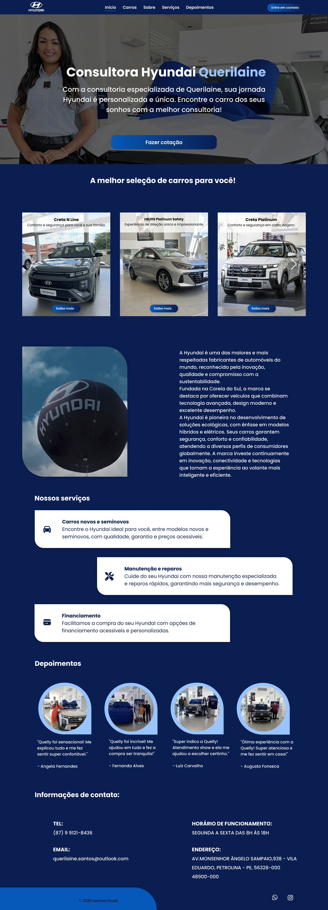
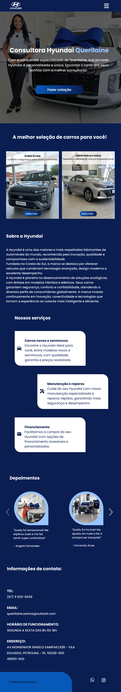

# Hyundai Consultora de Vendas - Querilaine Souza

**Desenvolvedora Front-End | HTML, CSS, JavaScript**

Este projeto consiste na criação de um **site para uma consultora de vendas da Hyundai**, com o objetivo de fornecer informações sobre a marca Hyundai, apresentar carros em destaque, descrever modelos de carros e oferecer um meio de contato para os clientes. O site foi desenvolvido utilizando **HTML**, **CSS**, e **JavaScript**, garantindo uma navegação intuitiva, responsiva e otimizada para dispositivos móveis e desktop.

## Visite o Site

Confira o projeto ao vivo acessando o link abaixo:

[Visite o Hyundai Consultora de Vendas](https://consultorahyundai.vercel.app)

## Sobre o Projeto

Este projeto foi criado para facilitar a apresentação de modelos da Hyundai e permitir que os clientes saibam mais sobre os carros da marca, com as principais funcionalidades incluindo:

- **Sobre a Hyundai**: Seção que apresenta a história da marca, seus valores e sua missão.
- **Carros em Destaque**: Apresentação de carros da Hyundai com links para suas respectivas descrições.
- **Descrição de Carros**: Página com detalhes e especificações dos modelos da Hyundai.
- **Contato**: Formulário de contato para os clientes entrarem em contato com a consultora de vendas.
- **Serviços**: Informações sobre os serviços oferecidos pela Hyundai, como manutenção e assistência.

## Tecnologias Utilizadas

Este projeto foi desenvolvido utilizando as seguintes tecnologias:

- **HTML5**: Estruturação do conteúdo de forma semântica, facilitando o SEO.
- **CSS3**: Estilização responsiva para garantir uma boa experiência em diferentes dispositivos.
- **JavaScript**: Funcionalidades interativas para a navegação e exibição de informações dinâmicas.
- **Vercel**: Para hospedagem do projeto.

## Como Rodar o Projeto

Para executar o projeto localmente, siga os passos abaixo:

1. **Clone o repositório**:
    ```bash
    git clone https://github.com/devLavinea/hyundai-consultora.git
    ```

2. **Abra o projeto no seu editor de código preferido**.

3. **Abra o arquivo `index.html` no navegador** para visualizar o site.

## Funcionalidades

- **Sobre a Hyundai**: Apresenta informações sobre a empresa e sua história.
- **Carros em Destaque**: Destaque para alguns dos modelos mais populares da Hyundai.
- **Página de Descrição de Carros**: Cada modelo tem uma página dedicada com informações detalhadas sobre o carro.
- **Formulário de Contato**: Permite que os clientes entrem em contato diretamente com a consultora de vendas.
- **Serviços**: Exibe os serviços oferecidos pela Hyundai, como manutenção e assistência técnica.
- **Design Responsivo**: O layout é otimizado para diversos dispositivos (desktop, tablet e celular).

## Como Contribuir

Se você quiser colaborar ou sugerir melhorias para o projeto, siga os passos abaixo:

1. Faça um fork deste repositório.
2. Crie uma nova branch para sua feature (`git checkout -b feature/nova-feature`).
3. Faça suas alterações e commit (`git commit -am 'Adicionando nova feature'`).
4. Envie suas mudanças para o repositório remoto (`git push origin feature/nova-feature`).
5. Abra um pull request para revisão.

## Licença

Este projeto está licenciado sob a Licença MIT - veja o arquivo [LICENSE](LICENSE) para mais detalhes.

## Contato

Caso tenha dúvidas ou sugestões sobre o projeto, você pode me encontrar nas seguintes plataformas:

- **Email**: lavinea2411@gmail.com
- **GitHub**: [devLavinea](https://github.com/devLavinea)

## Imagens

Aqui estão algumas capturas de tela do projeto em funcionamento:

### Página Inicial



### Página de Descrição do Carro Desktop


### Versão Tablet



### Página de Descrição do Carro Tablet


### Versão Mobile


---

Obrigado por conferir o meu projeto! 😊 Fique à vontade para sugerir melhorias ou abrir issues caso encontre algo que possa ser melhorado.
